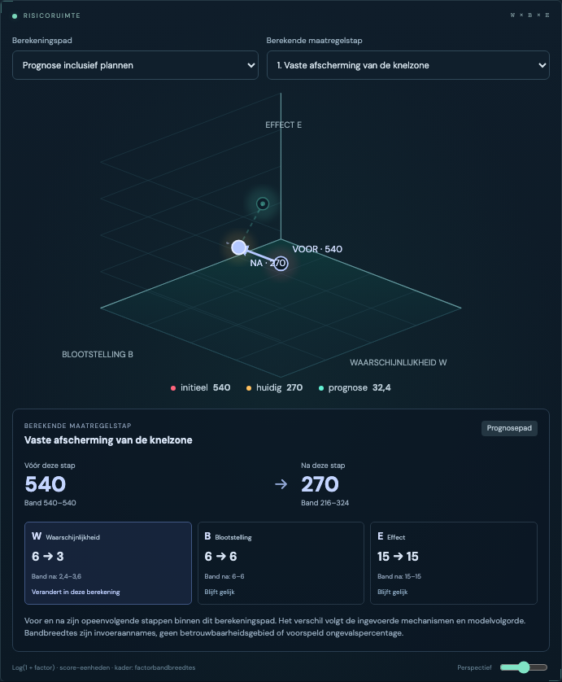

# Interactieve risicoruimte en frequentiegrafiek

De W/B/E-risicoruimte behoudt de drie overzichtspunten: uitgangsscenario, huidige beoordeling en prognose. De projectie gebruikt `log(1 + factor)`, zodat nul ook een eindige plaats krijgt. Afstand, gloed en de grootte van de punten zijn geen fysieke risicogrootheden.

Kies **Huidige bewezen beheersing** of **Prognose inclusief plannen**, en vervolgens een berekende maatregelstap. De keuzelijst bevat uitsluitend de `RiskStep`-records die de engine voor dat pad heeft gecrediteerd. Voor en na zijn opeenvolgende punten binnen hetzelfde pad; de interface berekent geen extra reductie. De bijbehorende score, scoreband en W/B/E-factoren komen rechtstreeks uit de engine. Een onveranderde factor wordt expliciet als gelijk weergegeven.

De stippellijnen rond het gekozen eindpunt tonen het rechthoekige bereik van de ingevoerde marginale factorgrenzen. Dit kader is geen verdeling, betrouwbaarheidsgebied of bewijs dat iedere hoekcombinatie fysiek mogelijk is. De tekst toont ook de score- en factorintervallen, zodat een vlakke of overlappende projectie geen informatie wegneemt. Geplande stappen blijven als prognose gelabeld.

Als de huidige berekening maatregelen crediteert die in de prognose door een alternatief afhankelijkheidspad worden vervangen, verschijnt **Representatief modelpad wisselt**. Een hoger of lager nominaal eindpunt kan dan door die modelselectie ontstaan. De lijn tussen huidig en prognose bewijst in dat geval geen causale verbetering of verslechtering door één maatregel. De geselecteerde stap wordt steeds binnen zijn eigen pad uitgelegd.

LOPA heeft een afzonderlijke logaritmische frequentie-as in gebeurtenissen per jaar. De as wordt afgeleid van de werkelijke positieve invoerwaarden, inclusief waarden kleiner dan `1e-12`. Een werkelijke nulondergrens ligt buiten de logaritmische as en krijgt een neerwaartse pijl met `0`; de zichtbare onderrand is alleen een grafische afkapgrens. Er wordt geen fictieve positieve ondergrens ingevoerd. Een criterium zonder vastgelegde basis heet **Onbevestigd criterium**.

Beide keuzelijsten zijn gewone toetsenbordbedienbare HTML-selecties. De berekende stap heeft een tekstalternatief met score- en factorbanden; de SVG heeft een actuele beschrijving. Op een smal scherm staan de factorkaarten onder elkaar. Er is geen koppeling tussen de Kinney-scorekleuren en de LOPA-frequentie-as.

Verificatie: betekenisvolle grensgevallen voor de frequentie-as staan in `web/src/components/frequency-axis.test.ts`, waaronder nul met positieve waarden onder `1e-12` en extreme eindige waarden zonder onderloop in de asticks.
